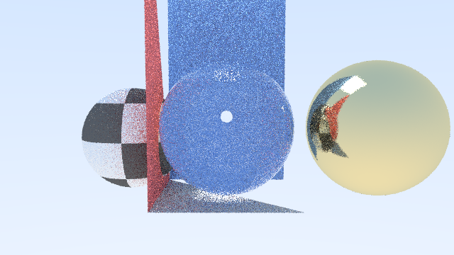
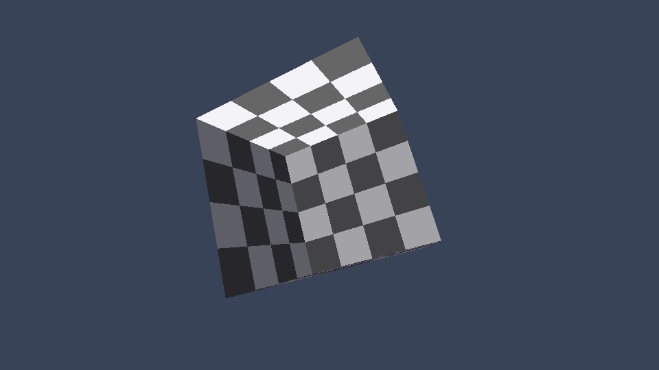
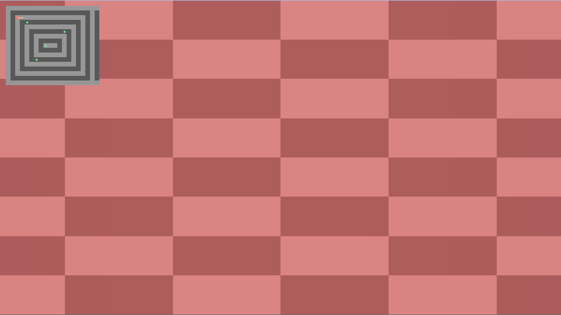

# Build Your Own 3D Renderer

A C++ learning project that implements three classic rendering approaches from scratch—no GPU APIs, only software rendering on the CPU.

## Screenshots

| Ray tracer (Cornell box) | Rasterizer | Raycaster |
|---|---|---|
|  |  |  |

## Phases

| Phase | Target | Description |
|-------|--------|-------------|
| 1 | `raytracer` | Recursive ray tracing with materials (RTOW-style) |
| 2 | `rasterizer` | Triangle mesh rasterization with z-buffer |
| 3 | `raycaster` | Wolfenstein-style 2.5D grid raycasting |

## Coordinate system

- **Handedness:** Right-handed
- **Up axis:** +Y
- **Camera forward:** Looks down **-Z** in view space (standard OpenGL-style camera math)
- **Color:** Linear RGB internally; gamma 2.0 applied on output

## Dependencies

macOS (Homebrew):

```bash
brew install cmake sdl2
```

Linux (Debian/Ubuntu):

```bash
sudo apt-get install -y build-essential cmake libsdl2-dev
```

## Build

```bash
cmake -S . -B build
cmake --build build
```

Or with presets:

```bash
cmake --preset default
cmake --build --preset default
```

## Run

### Desktop application

Launch the unified desktop app with all three renderers:

```bash
./build/renderer_app
```

**Controls**

| Key | Action |
|-----|--------|
| `1` | Switch to Ray Tracer (Cornell scene, progressive samples) |
| `2` | Switch to Rasterizer (rotating cube) |
| `3` | Switch to Raycaster (Wolfenstein-style demo) |
| `S` | Save current frame to `output/<mode>.png` |
| `R` | Reset current mode |
| `Esc` | Quit |

Mode-specific controls are shown in the window title. Rasterizer: drag to orbit, `F` wireframe, `D` debug view. Raycaster: WASD move, arrows/mouse turn, `M` toggle mouse capture.

### Phase 1 — Ray tracer

Random sphere scene (default):

```bash
./build/raytracer --output image.ppm
```

Cornell-style scene file with live SDL preview:

```bash
./build/raytracer --scene assets/scenes/cornell.scene --preview --samples 40
```

Options: `--width`, `--height`, `--samples`, `--max-depth`, `--threads`, `--obj`, `--camera-yaw`, `--dump-ppm`, `--help`

Scene files support `sphere` and `quad` primitives. Worlds are accelerated with a BVH; rendering uses 32×32 tile threading.

Output supports `.png` and `.ppm` via `--output`.

### Phase 2 — Software rasterizer

Rotating cube (default):

```bash
./build/rasterizer
```

Load an OBJ mesh:

```bash
./build/rasterizer --obj assets/models/cube.obj
./build/rasterizer --obj assets/models/cube.obj --texture assets/textures/checker.png --wireframe
```

Drag with the left mouse button to orbit the camera.

Options: `--texture`, `--wireframe`, `--debug depth|normal|uv`, `--output`, `--dump-ppm`, `--help`

### Phase 3 — Raycaster

WASD to move, Left/Right arrows to turn, mouse to look. Minimap shown in the top-left.

```bash
./build/raycaster
./build/raycaster --map assets/maps/level1.txt --spawn assets/maps/level1.spawn --capture-mouse
```

Options: `--map`, `--spawn`, `--textures`, `--capture-mouse`, `--output`, `--dump-ppm`, `--help`

Committed textures live in [`assets/textures/`](assets/textures/) as PNG files.

## Testing

```bash
cmake --build build
ctest --test-dir build --output-on-failure
```

Smoke-test all renderers headlessly:

```bash
./build/raytracer --width 64 --height 36 --samples 2 --dump-ppm
./build/rasterizer --dump-ppm
./build/raycaster --dump-ppm
```

## Install and package

```bash
cmake --build build
cmake --install build --prefix dist
```

Creates `dist/bin/renderer_app` and installs bundled assets to `dist/share/3d-renderer/assets`.

Package a release archive with CPack:

```bash
cd build
cpack -G TGZ
```

## Project layout

```
include/renderer/   Shared headers (math, core, platform, app)
src/app/            Desktop application shell
src/raytracer/      Phase 1
src/rasterizer/     Phase 2
src/raycaster/      Phase 3
assets/             Scenes, models, textures
```

## References

Inspired by [build-your-own-x](https://github.com/codecrafters-io/build-your-own-x#build-your-own-3d-renderer):

- [Ray Tracing in One Weekend](https://raytracing.github.io/)
- [Rasterization: a Practical Implementation](https://www.scratchapixel.com/lessons/3d-basic-rendering/rasterization-practical-implementation)
- [Raycasting engine of Wolfenstein 3D](https://lodev.org/cgtutor/raycasting.html)

## License

This project is licensed under the [MIT License](LICENSE).
